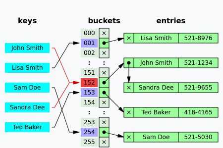
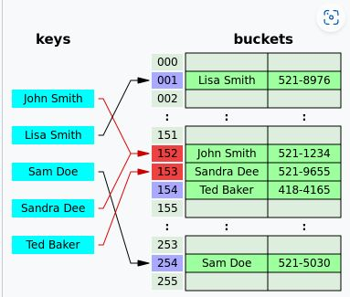
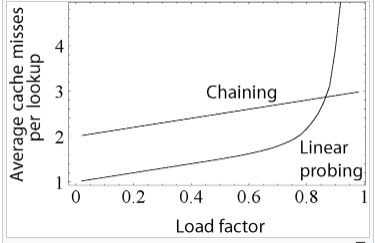

Hash Maps  
  
Complexities   
Seach - O(1)   
Insert - **O(1) avg, O(n) worst due to rebuilds**  
  
load factor = **n/m (m is number of buckets)**  
  
Collision Resolution  
  
Chaining - **Bucket slot is a reference to a linkedlist/binary search tree/dynamic array. Locality of reference helps if dynamic array is chosen.**  
  
  
Open addressing (closed hashing) - **Hash then probe if not found. Probe can be linear, quadratic, or double hashed.**  
  
  

---
