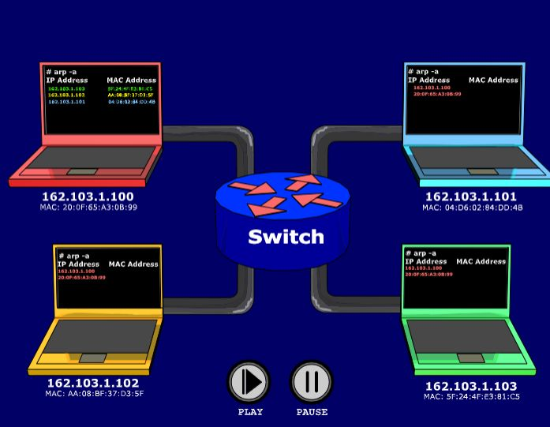

ARP - Address Resolution Protocol  
  
Maps **IP -> MAC**  
Allows dynamic routing with smaller fwd tables based on IP prefixes instead of hardwired MACs  
ARP tables present of every node **map IP -> MAC -- Slowly filled in with broadcasted ARP requests and responses**  
  
Command to see arp table --  
**arp -a**  
In larger networks, router forwards to the appropriate MAC addr.

---
