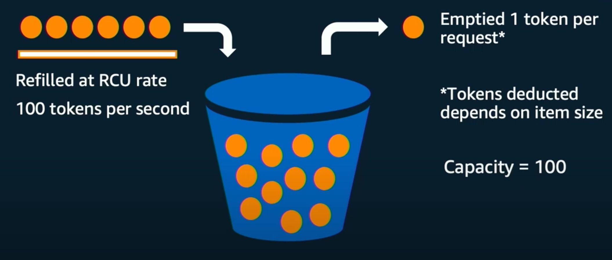
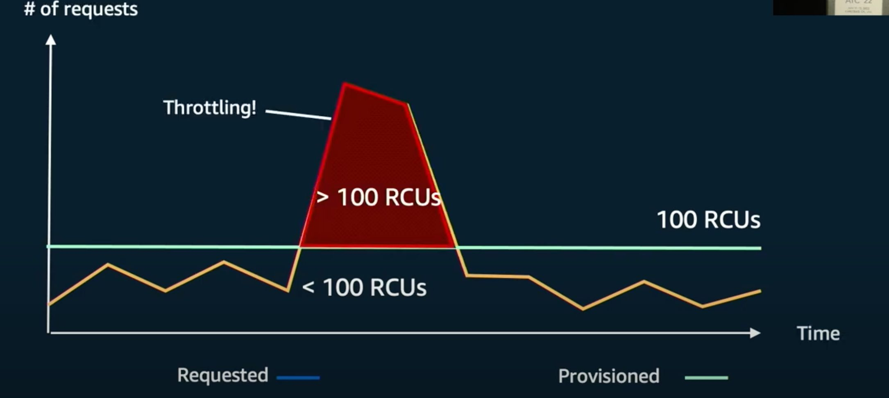
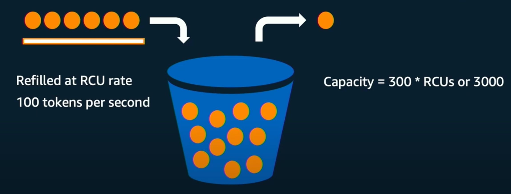
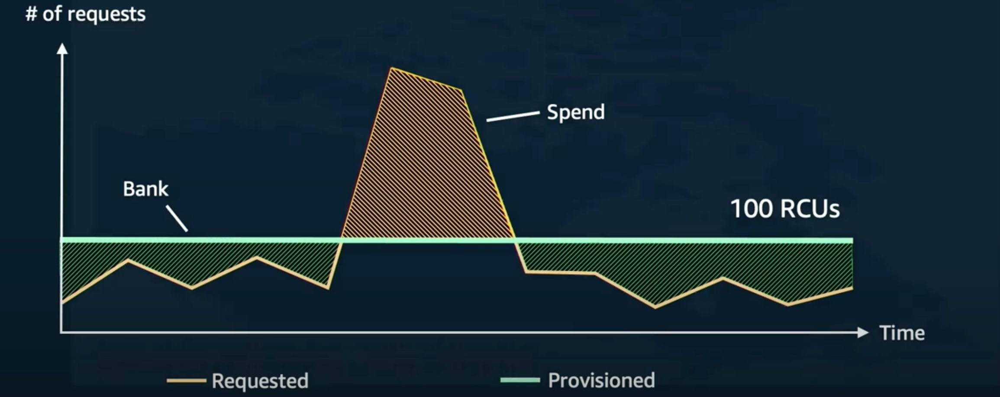

Amazon Dynamo DB Token Bucket Algorithm and Bursting

---
  
  
Use for ratelimiting clients based on their provisioned capacity  
Tables are provisioned with ReadCapacityUnit as a metric.   
1 RCU = 4kb per sec.  
Throttles clients if no tokens are available.  
  
Bursting  
  
  
  
