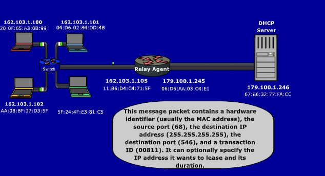

Dynamic Host Configuration Protocol (DHCP)  
  
Assigns IP using DHCP server  
DHCPDISCOVER msg send to **port 546 via UDP** using addr **255.255.255.255** -- multiplexed by switch  
Only relay agents (routers to DHCP server IPs configured) or servers can process req  

---
