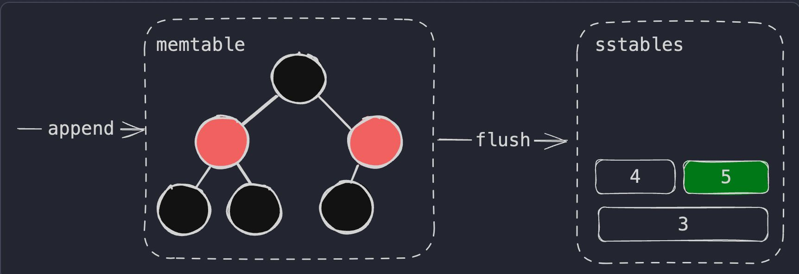

Immutable LSM Tree  
  
Log structured merge tree - Combination of **in-memory sorted data structure** (like AVL tree / Red-black tree) + on-disk **Sorted String Table (SSTable)** + on-disk **write ahead log (WAL)** for recovery   
  
  
  
An SSTable stores sorted data, letting us leverage binary search and sparse indexes to lower the amount of disk I/O -- Requires **compaction** and deletion of **tombstones**.  
Can be optimized with bloom filters for sstable search.   
  
Used by RocksDB, cassandra, scylladb etc.

---
