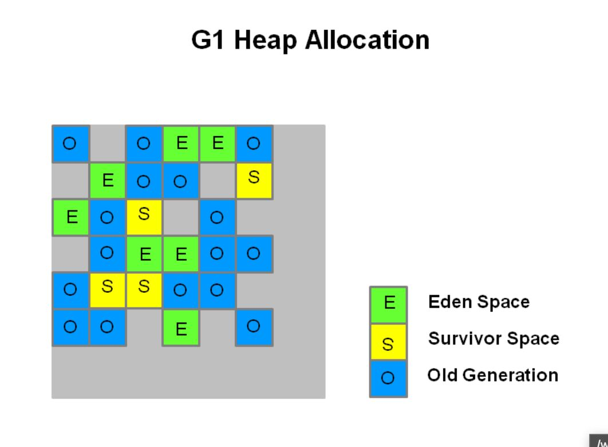

Java GC  
  
GC tuning is a tradeoff b/w **responsiveness and throughput**  
  
Eden --filled-up-> Minor GC (Referenced objects **are moved to survivor space 0** & Unreferenced obj deleted) --> Next Minor GC --> Eden referenced objs **moved to S1** & S0 referenced objs **aged** and moved to S1 --> Other way around for next minot GC --> After tenure surviving objects **promoted to old generation** --> Major GC for full memory (rare)  
  
Common JVM Parameters  
  

`-Xms`

**Sets the initial heap size for when the JVM starts.**

`-Xmx`

**Sets the maximum heap size.**

`-Xmn`

**Sets the size of the Young Generation.**

\-XX:PermSize

**Sets the starting size of the Permanent Generation.**

\-XX:MaxPermSize

{{

Sets the max size of the Perm Gen

}}  
  

### **Concurrent Mark Sweep** (CMS) Collector

For concurrent collection of old gen with app threads. Does not **compact or copy live objs.**

### **Garbage-first** (G1) Collector

Multiple fixed size regions divided into eden, survivor and old. Collects garbage first regions first (with most **non-live objs**).

Non contiguous regions allow for easy **re-size**. Copies and compacts when reclaiming. Keeps accounting info called Rsets and Csets to modify the region size and optimize collection to meet the latency requirement.

  

\-XX:MaxGCPauseMillis=200 - Sets a target for the maximum GC pause time. This is a soft goal, and the JVM will make its best effort to achieve it. Therefore, the pause time goal will sometimes not be met.   
  
\-XX:InitiatingHeapOccupancyPercent=45 - **Percentage of the (entire) heap occupancy to start a concurrent GC cycle. **  
  

  

  

  

GC logs:

before->after(total)

Times: user, sys, real

user+sys > real => **Good multithreading**

real >> user + sys => **Other IO-like issues**

---
[Getting Started with the G1 Garbage Collector (oracle.com)](https://www.oracle.com/technetwork/tutorials/tutorials-1876574.html)  
[Java Garbage Collection Basics (oracle.com)](https://www.oracle.com/webfolder/technetwork/tutorials/obe/java/gc01/index.html#:~:text=Automatic%20garbage%20collection%20is%20the,a%20pointer%20to%20that%20object.)