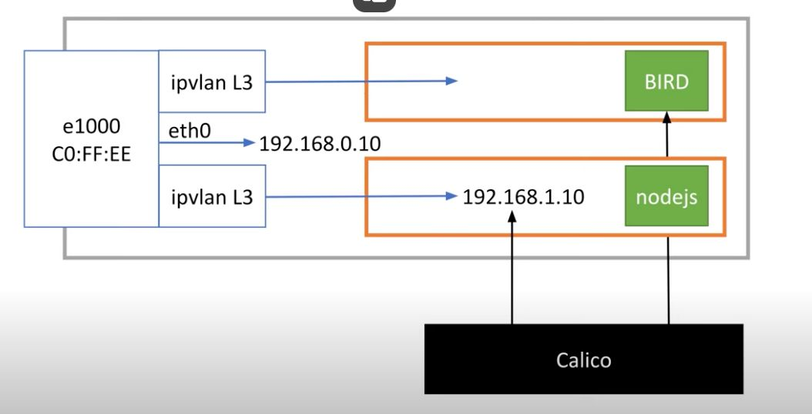

Linux interface  
Linux interface backed by software  
VPN with software backed interface  
tap interface and virtual bridges  
VMs using virtual bridges  
veth pairs  
Containers with veth pairs  
vlan, macvlan (macvtap), ipvlan l2 (ipvtap), ipvlan l3 (needs overlay network)  
[(17) Software Networking and Interfaces on Linux: Part 2 - YouTube](https://www.youtube.com/watch?v=5WNEpE1vLvc)

---
eth0 interface with an IP. Network card - hardware, firmware and driver software  
  
  
  
Connections go to 172 address that is a tun interface backed by s/w. S/w encrypts and wraps the message and sends it to the VPN servers which forwards it.  
  
  
  
packetd communicating with outside world (kinda how a router works)  
  
  
  
tap0 is at a lower level (lev 2 - has MAC address - can do stuff like ARP and DHCP)  
  
  
  
qemu (vitualization s/w) can emulate hardware for the VM  
  
  
  
If the OS of the VM knows that the h/w is emulated, it can be much faster - para virtualization.  
  
veth pair with one end in the container network namespace.  
  
  
  
