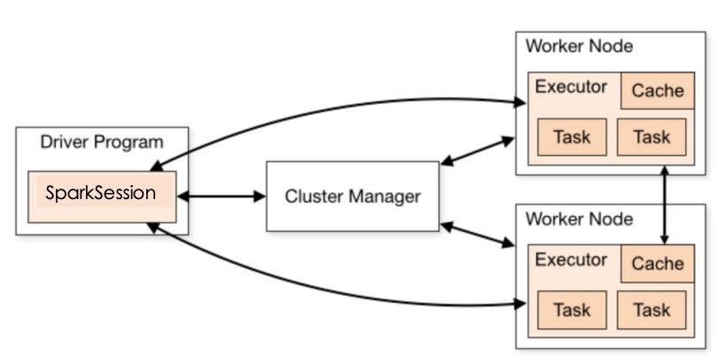

Spark  

- Big data **DAG** execution engine that works on **Resilient Distributed Datasets (RDDs)**
- Allows in-memory and on-disk caching and hence offers better perf for **interactive and iterative usecases**
- RDD - Read only collection partitioned acrosss nodes that can be retrieved even if a partition is lost
- RDD1 ---**Transform**--> RDD2
- **Action** to materialize an RDD (**Lazy evaluation**)

  

  

Application > **Jobs (split by action/shuffle)** > **Stage (each transformation)** > **Task (same operation executed in parallel)**

  

**Shuffle** - Physical repartitioning of data across executors (required for certain ops like join, groupby)

**Broadcast variable** - Readonly shared variables cached on all nodes for easy access

  

numTasks > numCoresPerExecutor x numExecutors

---
